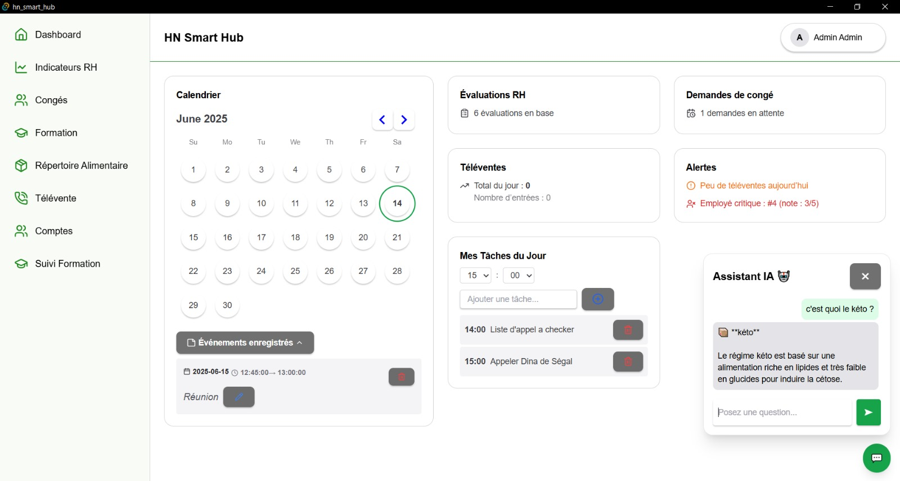
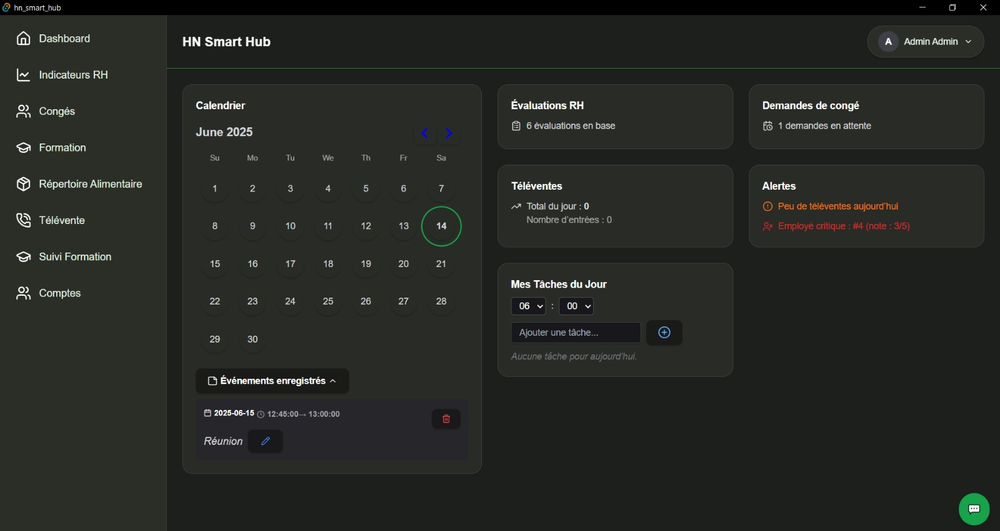

# 🧠 HN Smart Hub

**HN Smart Hub** est une application de bureau moderne, performante et fonctionnelle, développée avec **Tauri**, **TypeScript**, **Rust** et **React**. Elle est conçue pour centraliser la gestion RH, les ventes, la formation et l'assistance client dans un environnement ergonomique et réactif.

---

## 🎨 Aperçu visuel

### 🌞 Thème clair


### 🌙 Thème sombre


---

## 🚀 Fonctionnalités principales

### 🔐 Authentification sécurisée
- Système de login avec gestion des rôles (admin / utilisateur).
- Redirection automatique vers le dashboard approprié après connexion.

### 🧭 Dashboard interactif
- Vue d'ensemble personnalisée selon le rôle.
- Widgets dynamiques : alertes, congés restants, rappels, indicateurs RH à traiter.

### 📊 Indicateurs RH
- Visualisation et évaluation des employés (grilles 1–10).
- Accès restreint selon les rôles.
- Filtres dynamiques pour une navigation rapide.

### 🌴 Congés
- Système de demande et validation.
- Compteur de jours restants.
- Calendrier interactif synchronisé.

### 🥦 Répertoire alimentaire
- Accès rapide à une base de produits alimentaires.
- Descriptions détaillées utiles pour les appels clients.

### 📞 Télévente
- Formulaire de saisie rapide avec jauge de progression.
- Vue détaillée des ventes par utilisateur.
- Statistiques & succès débloquables.
- Vue admin : comparatif, filtres, export PDF.

### 🎓 Formation
- Modules de formation interactifs (Acomba, commandes, routes, appels, etc.).
- Quiz de validation intégrés.
- Suivi de progression visible par les admins.

### 👤 Gestion de compte
- Création/modification des utilisateurs (admin only).
- Rôles attribués dynamiquement.

### 👥 Vue différenciée selon le rôle
- Interface utilisateur personnalisée.
- Admins ont accès à la gestion RH, formations, ventes, création de comptes, etc.

### 📆 Événements
- Ajout de rappels dans le calendrier intégré.
- Visualisation claire des événements planifiés.

### ✅ Todo List
- Gestion simple des tâches journalières.
- Intégrée au dashboard.

### 🚨 Alerte widget
- Notifications dynamiques selon le contexte (vente à faire, client à rappeler, etc.).

### 🤖 Assistant IA local (offline)
- Chatbot local embarqué (Rust - Concept : Regex, Intent, StaticWords, HashMap).
- Capable de répondre à des questions métier (congés restants, infos produits, etc.).
- Intelligence d’intention avec reconnaissance sémantique.

---

## 🔌 Mode hors-ligne

L’application inclut un système **offline-first** :
- Les actions (ex : demande de congé) sont stockées localement si la connexion échoue.
- Synchronisation automatique dès que la connexion est rétablie.

---

## 🛠️ Stack technique

| Frontend          | Backend / Logiciel |
|-------------------|---------------------|
| TypeScript        | Rust (Tauri)        |
| React             | SQLx + PostgreSQL   |
| Tailwind CSS      | Elixir (assistant)  |
| Framer Motion     |                     |

---

## 🧠 Objectifs pédagogiques

Ce projet m’a permis de :

- Approfondir Rust dans un contexte applicatif concret.  
- Créer un design moderne avec React + Tailwind.  
- Expérimenter les architectures offline-first.  
- Intégrer une IA locale avec logique d’intention.  
- Gérer un projet complet en frontend + backend.

---

## 📸 Crédits & Remerciements

- 💡 Interface inspirée du projet [`tauri-ui`](https://github.com/agmmnn) d’[@agmmnn](https://github.com/agmmnn) — un grand merci pour cette base solide et élégante.
- 🎨 Palette de couleurs : **Marble** (`#F2F8DC`) & **Dark Blue** (`#0F172A`)
- 🖼 Icônes : [Lucide](https://lucide.dev/)
- 📊 Graphiques : [Recharts](https://recharts.org/)

---

## 💼 Auteur

👨‍💻 **0xAdafang - Térence**  
📫 [adafang@proton.me]  
🇨🇦 Projet réalisé a Montrea/Québec dans le cadre d’un stage de fin d’études, l'application sera deployé et utiliser par l'entreprise qui m'a mendaté pour mon stage

---

## 📦 Installation (mode dev)

```bash
git clone https://github.com/votre-username/hn-smart-hub
cd hn-smart-hub
npm install
npm run tauri dev

